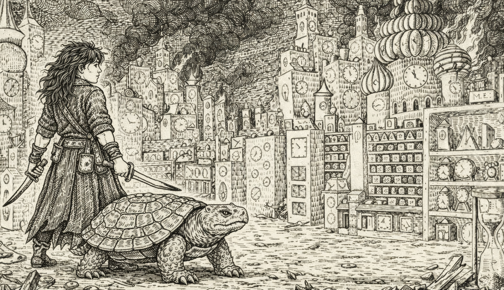
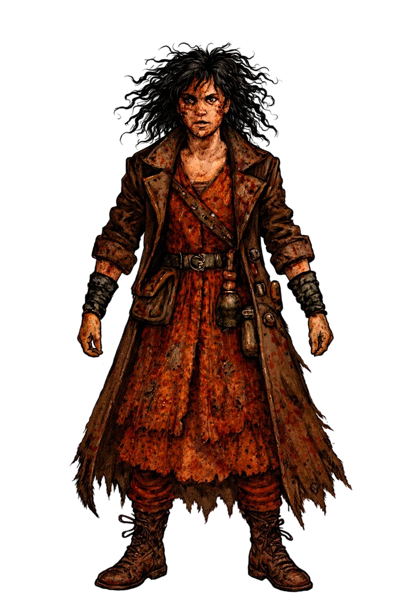
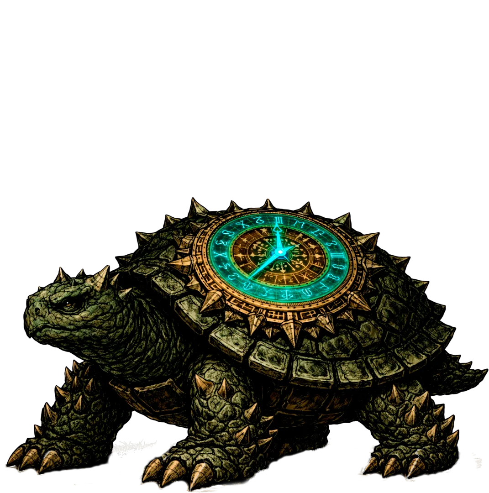
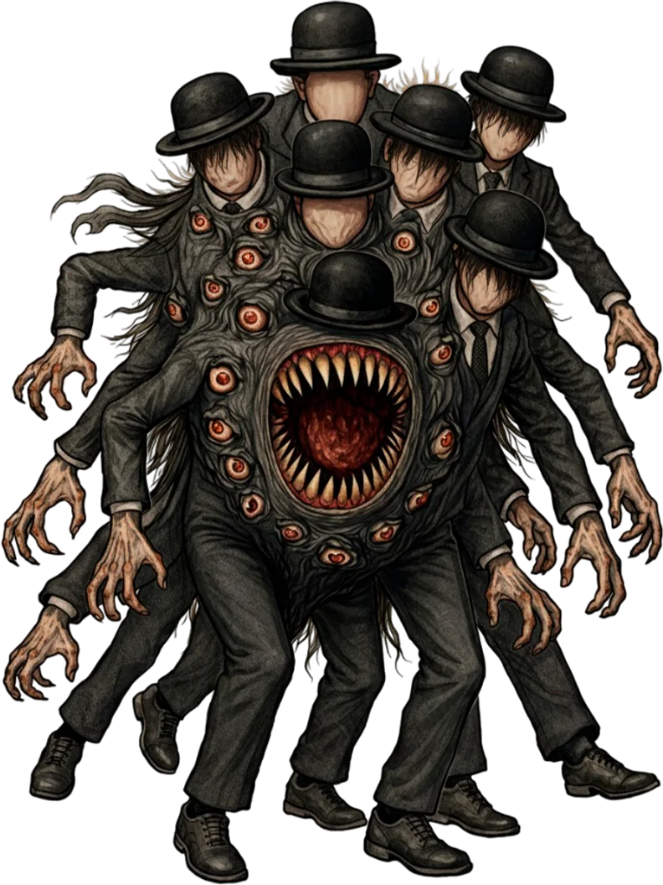
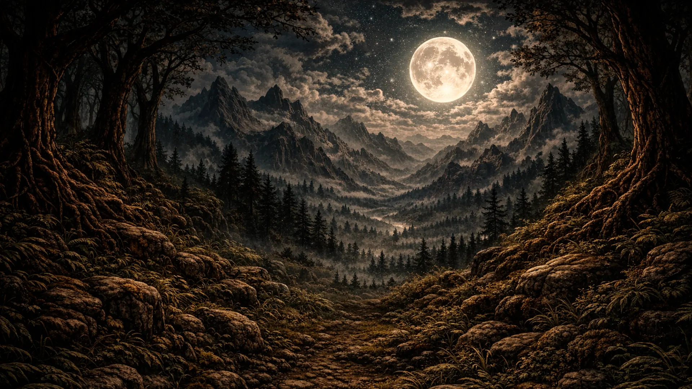
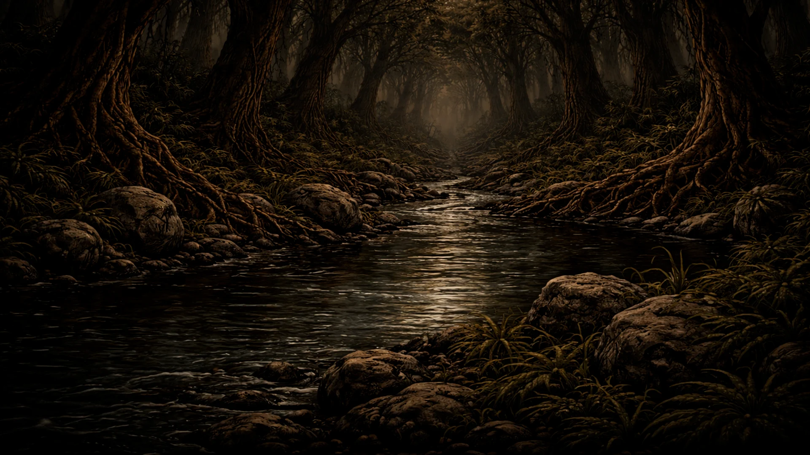
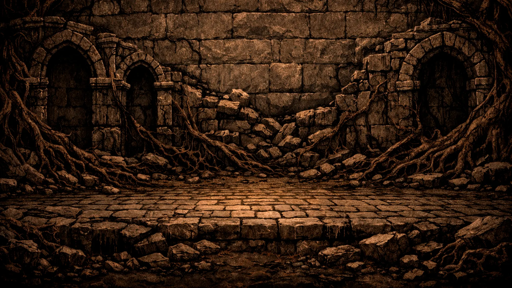

<div align="center">
  
</div>

<br>

<h1 align="center">⏳ Momo Time Huntress ⏳</h1>

<p align="center">
  <em>A visual novel about time, loss, and the monsters that feed on both.</em>
</p>

<br>

<p align="center">
  
  
  
  
    
</p>

<p align="center">
  <a href="https://blackars.itch.io/momo-time-huntress">🎮 Play on Itch.io</a> · Compatible with all browsers on desktop, tablet & mobile 📱
</p>

---

## 📖 Synopsis

Momo wanders through a dying forest alongside Casiopeia, her silent companion. Together they hunt the **Gray Gentlemen Anomaly** — eldritch beings that consume time itself, erasing worlds second by second.

> *"They erased my world. I will erase them in return."*

Between ruins swallowed by moss, rivers that hide their scent from pattern-tracking predators, and a castle that pulses with stolen seconds, Momo must confront not just the monsters that feed on time, but the truth of what they are — and what they've awakened.

---

## 🎮 Features

| Feature | Description |
|---------|-------------|
| 🖼️ **Full HD Visuals** | Hand-drawn backgrounds and sprites at 1920x1080 |
| 🎬 **Cinematic Cutscenes** | Embedded video sequences for key story moments |
| 🎵 **Original Soundtrack** | Ambient dark fantasy audio scoring |
| 💬 **Dialogue Choices** | Branching narrative with meaningful decisions |
| 📖 **NVL Storytelling** | Book-style narrative passages within the game |
| 🎭 **Live2D-style Sprites** | Multiple expressions and poses for each character |

---

## 🧩 Characters

<div align="center">
  
</div>

### Momo 🗡️
> *The last huntress of a consumed world.*

Fierce, scarred, and relentless. Momo carries the weight of a reality already erased by the Gray Gentlemen. She speaks to Casiopeia as if reading their silence, finds beauty in ruins, and sharpens her grief into a blade.

<div align="center">
  
</div>

### Casiopeia 🐢
> *A silent presence that speaks in symbols.*

Casiopeia never speaks — but Momo understands every silence. They trace mysterious symbols in the air, feel vibrations before anomalies arrive, and seem to know more than they let on.

<div align="center">
  
</div>

### The Gray Gentlemen Anomaly 👤
> *They do not hunt like beasts. They calculate.*

Beings from beyond reality that consume time itself. Each arrival leaves a crater. Each word is a distorted echo. They claim to be searching for something more powerful — or fleeing from it.

---

## 🛠️ Tech Stack

| Layer | Technology |
|-------|-----------|
| 🎮 **Engine** | [Ren'Py](https://www.renpy.org/) 8.0+ |
| 🖌️ **Resolution** | 1920x1080 (Full HD) |
| 🎵 **Audio** | OGG Vorbis (ambient & sfx) |
| 🖼️ **Graphics** | WebP sprites & backgrounds |
| 🎬 **Video** | WebM embedded cutscenes |
| 📜 **Scripting** | Ren'Py `.rpy` (Python-based DSL) |
| 📱 **Platforms** | Windows / macOS / Linux / Android / Web |

---

## 🚀 How to Run

### Prerequisites
- [Ren'Py SDK 8.0+](https://www.renpy.org/latest.html)

### Steps
1. Clone this repository:
   ```bash
   git clone https://github.com/yourusername/momo-time-huntress.git
   ```
2. Open Ren'Py Launcher.
3. Click **"Preferences"** and add the project directory.
4. Select **Momo Time Huntress** from the project list.
5. Click **"Launch Project"**.

---

## 📁 Project Structure

```
Momo Time Huntress/
├── game/
│   ├── script.rpy          # Main story script
│   ├── options.rpy         # Game configuration
│   ├── gui.rpy             # GUI styles & layout
│   ├── screens.rpy         # UI screens
│   ├── resources.rpy       # Characters, images & transforms
│   ├── images/
│   │   ├── backgrounds/    # Scene backgrounds (.webp)
│   │   ├── sprites/        # Character sprites (momo, casiopeia, grayg)
│   │   └── gui/            # Interface assets
│   ├── audio/              # Music & SFX (.ogg)
│   ├── gui/                # GUI image assets
│   └── saves/              # Save data (gitignored)
├── .gitignore
└── README.md
```

---

## 🖼️ Screenshots

<!-- TODO: Add screenshots here -->
<div align="center">
  <table>
    <tr>
      <td align="center"><strong>🌲 Forest</strong></td>
      <td align="center"><strong>🌊 River</strong></td>
      <td align="center"><strong>🏚️ Ruins</strong></td>
    </tr>
    <tr>
      <td></td>
      <td></td>
      <td></td>
    </tr>
  </table>
</div>

<!-- 
  TODO: Replace the placeholders above with actual in-game screenshots.
  Recommended: capture gameplay with dialogue, choices, and cutscene frames.
-->

---

## 🎵 Audio Credits

| Track | Usage |
|-------|-------|
| `forestambient.ogg` | Forest exploration music |
| `riversound.ogg` | River sequences |
| `darkambient.ogg` | Ruins & tension scenes |
| `graygtalk1.ogg` / `graygtalk2.ogg` | Gray Gentlemen distorted voice |
| `braams1.ogg` | Cinematic impact sound |

---

## 📜 License

<!-- TODO: Add your license here -->
All rights reserved © 2026 — Momo Time Huntress

---

<p align="center">
  Made with ❤️ and <a href="https://www.renpy.org/">Ren'Py</a>
</p>
